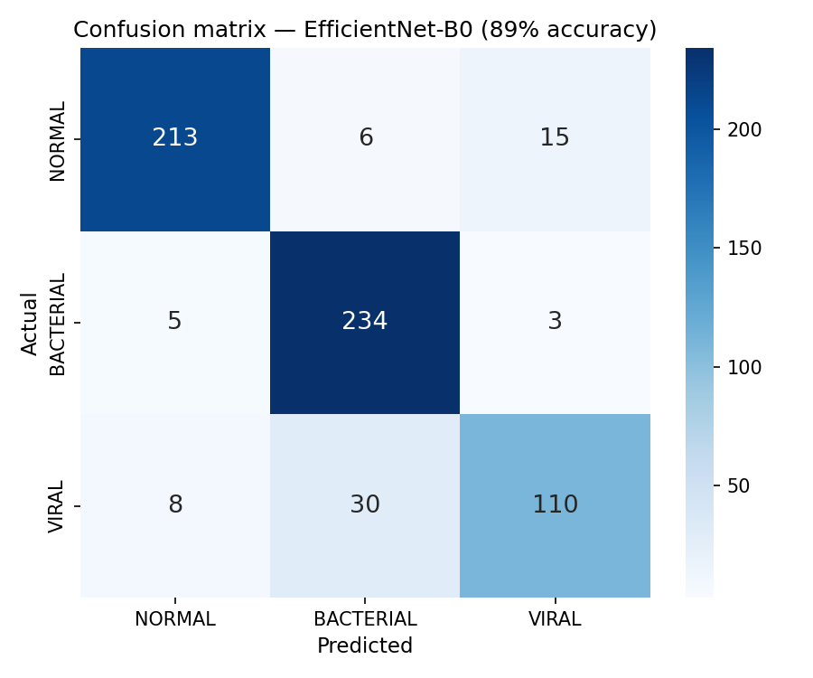
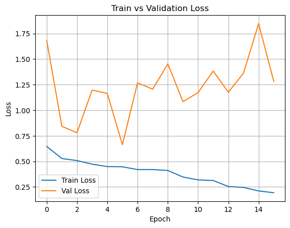
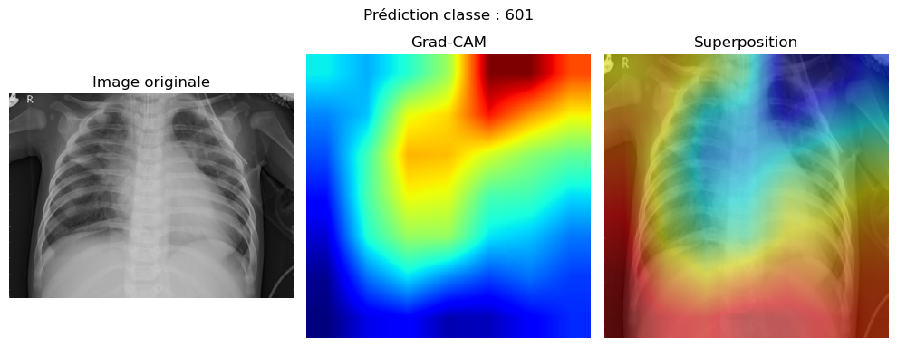

# PneumonIA — Chest X-Ray Classification (EfficientNet-B0 + Grad-CAM)

Deep learning pipeline classifying chest radiographs into three classes: **NORMAL**, **BACTERIAL pneumonia** and **VIRAL pneumonia**.

**Best result: EfficientNet-B0 fine-tuned — 89% accuracy, 0.88 macro F1 on a 624-image test set.**

> **Scope.** This started as a five-person academic project at Epitech. This repository contains **only my own contribution**: the EfficientNet-B0 pipeline, the class-imbalance work, the PCA baselines and the Grad-CAM interpretability layer. Other architectures explored by teammates are not included here.

---

## Why three classes and not two

The usual version of this task is binary — normal vs. pneumonia — which is close to solved and not clinically very useful. Separating **bacterial** from **viral** pneumonia matters more, because treatment differs, and it is genuinely harder: the two overlap visually far more than either does with a healthy lung.

That difficulty drives everything below.

---

## Results

Test set: **624 images** — 234 NORMAL, 242 BACTERIAL, 148 VIRAL.







### Deep learning

| Model | Accuracy | Macro F1 | VIRAL F1 | Notes |
|---|---|---|---|---|
| CNN trained from scratch | 0.80 | 0.50 | **0.00** | Never predicts VIRAL at all |
| CNN + class weighting | 0.70 | 0.67 | 0.63 | VIRAL becomes detectable |
| **EfficientNet-B0 fine-tuned** | **0.89** | **0.88** | **0.80** | Best overall |

Per-class results for the best model:

| Class | Precision | Recall | F1 | Support |
|---|---|---|---|---|
| NORMAL | 0.94 | 0.91 | 0.93 | 234 |
| BACTERIAL | 0.87 | 0.97 | 0.91 | 242 |
| VIRAL | 0.86 | 0.74 | 0.80 | 148 |

```
Confusion matrix
            NORMAL  BACTERIAL  VIRAL
NORMAL        213        6      15
BACTERIAL       5      234       3
VIRAL           8       30     110
```

The remaining weakness is visible in the last row: 30 viral cases are still read as bacterial. Precision on VIRAL is high (0.86) — when the model says viral, it is usually right — but recall lags at 0.74.

### Classic ML baselines

EfficientNet features, reduced with PCA (40 components, ~90% cumulative variance), then classified:

| Model | Accuracy | Macro F1 | VIRAL F1 |
|---|---|---|---|
| Logistic Regression | 0.76 | 0.74 | 0.65 |
| Random Forest | 0.66 | 0.64 | 0.58 |

Useful as a sanity floor: logistic regression on pretrained features already beats a CNN trained from scratch, which says most of the signal comes from the pretrained representation rather than from task-specific training.

---

## The result worth reading carefully

The scratch CNN reaches **80% accuracy with a macro F1 of 0.50 and a VIRAL F1 of exactly zero**. It learned to ignore the smallest class entirely and still scored well, because accuracy rewards that on an imbalanced set.

This is the most useful thing the project taught me: **on imbalanced data, accuracy is not a metric, it is a decoy.** Every number reported above is paired with a macro F1 and a confusion matrix for that reason.

What fixed it, in rough order of impact:

1. **Transfer learning.** Pretrained ImageNet features carried the largest single jump.
2. **Class weighting** in the loss, so the rare class stopped being cheap to ignore.
3. **Augmentation applied to the training split only** — validation and test kept deliberately plain. Augmenting all splits had been quietly inflating earlier results.
4. **Learning rate scheduler and early stopping** (patience 10), which stopped training once validation loss stopped improving.

---

## Interpretability

Predictions are explained with **Grad-CAM**, implemented with PyTorch forward and backward hooks on the last convolutional block, producing an activation heatmap overlaid on the original radiograph.

On a medical task this is not decoration: it is the cheapest way to check that the model looks at lung tissue rather than at scanner artifacts, image borders, or annotation markers.

---

## Stack

- **Python 3.8+**
- **Deep learning** — PyTorch, torchvision (`efficientnet_b0`)
- **Classic ML** — scikit-learn (logistic regression, random forest, PCA)
- **Image processing** — OpenCV, Pillow
- **Data & numerics** — NumPy, pandas
- **Visualization** — Matplotlib, Seaborn
- **Interpretability** — Grad-CAM via PyTorch hooks
- **Acceleration** — CUDA and Apple MPS both supported

---

## Getting started

```bash
git clone https://github.com/JinClaudius/PneumonIA.git
cd PneumonIA

python -m venv .venv
source .venv/bin/activate        # Windows: .venv\Scripts\activate
pip install -r requirements.txt
```

Dataset: [SOURCE + LICENCE À COMPLÉTER — probablement Kermany et al., chest X-ray, sur Kaggle].
Expected layout:

```
dataset/
├── train/   ├── NORMAL/  ├── BACTERIAL/  └── VIRAL/
├── val/
└── test/
```

Notebooks, in order:

```
notebooks/
├── 01_baselines_pca.ipynb          # feature extraction, PCA, classic ML
└── 02_efficientnet_gradcam.ipynb   # training, evaluation, interpretability
```

Neither the dataset nor the trained weights are versioned here (1.2 GB and 52 MB respectively).

---

## Limitations

Stated plainly, because a medical model that hides these is worse than one that has them:

- **Not a diagnostic tool.** Academic project — no clinical validation, no regulatory approval, no prospective evaluation.
- **Single-source dataset.** Nothing here demonstrates generalization to other hospitals, scanners, or patient populations — the classic failure mode of chest X-ray models.
- **No cross-validation.** Results come from one fixed split, so the reported figures carry more variance than a single decimal suggests.
- **Small VIRAL class** (148 test images), which makes its F1 the least stable number in the tables.
- **Erratic validation loss** during fine-tuning, only partly mitigated by the scheduler.

## Next steps

- k-fold cross-validation for confidence intervals rather than point estimates
- Test-time augmentation and model ensembling
- Threshold tuning driven by clinical cost — a missed pneumonia and a false alarm are not symmetric errors
- External validation on a second, independent dataset
- Serving the best model behind a FastAPI endpoint

---

## Author

**Jean Gouttier** — Applied AI & Information Systems, Epitech
[Portfolio](https://portfolio-gouttier-jean.vercel.app/) · [LinkedIn](https://linkedin.com/in/jeangouttier) · gouttierjean@gmail.com
